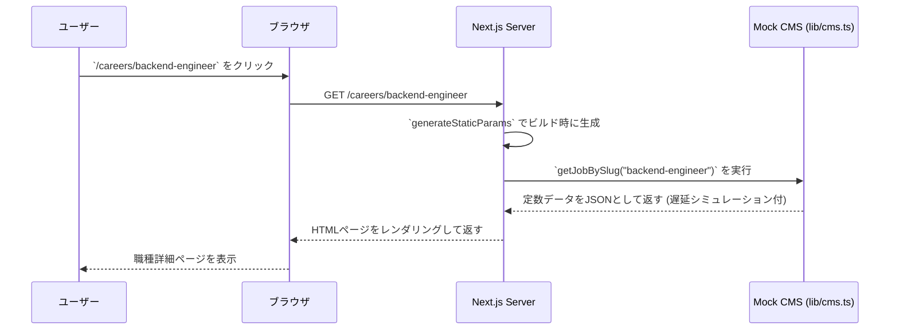

# 詳細設計書 - 株式会社MedicAI 採用サイト

## 1. 概要

本ドキュメントは、基本設計書に基づき、各コンポーネント、データ構造、処理フローをより詳細に定義する。

## 2. コンポーネント詳細設計

### 2.1. ページコンポーネント (`app/` ディレクトリ)

#### `app/careers/[slug]/page.tsx` (募集職種詳細ページ)

-   **役割**: 単一の募集職種に関する詳細情報を表示する。URLの `slug` に基づいて動的に生成される。
-   **データ取得**:
    -   サーバーサイドで `lib/cms.ts` の `getJobBySlug(slug)` を呼び出し、該当する職種のデータを取得する。
    -   データが存在しない場合は `notFound()` を呼び出し、404ページを表示する。
-   **使用コンポーネント**:
    -   `layout/Header`
    -   `layout/Footer`
    -   `ui/Heading`: 職種名を表示
    -   `ui/MarkdownRenderer`: `description` (Markdown形式) をHTMLとして描画
    -   `ui/Button`: 応募フォームへのリンク
-   **Propsの型定義**:
    ```typescript
    interface PageProps {
      params: {
        slug: string;
      };
    }
    ```

### 2.2. UIコンポーネント (`components/ui/`)

#### `components/ui/Button.tsx`

-   **役割**: サイト全体で一貫したスタイルのボタンを提供する。
-   **Propsの型定義**:
    ```typescript
    import { cva, type VariantProps } from "class-variance-authority";

    const buttonVariants = cva(
      "inline-flex items-center justify-center rounded-md text-sm font-medium transition-colors focus-visible:outline-none disabled:pointer-events-none disabled:opacity-50",
      {
        variants: {
          variant: {
            default: "bg-primary text-primary-foreground hover:bg-primary/90",
            outline: "border border-input bg-background hover:bg-accent",
          },
          size: {
            default: "h-10 px-4 py-2",
            sm: "h-9 rounded-md px-3",
            lg: "h-11 rounded-md px-8",
          },
        },
        defaultVariants: {
          variant: "default",
          size: "default",
        },
      }
    );

    export interface ButtonProps
      extends React.ButtonHTMLAttributes<HTMLButtonElement>,
        VariantProps<typeof buttonVariants> {}
    ```
-   **実装**: class-variance-authority (cva) を用いて、variantとsizeに応じたTailwind CSSクラスを動的に適用する。

#### `components/ui/Card.tsx`

-   **役割**: 事業内容やブログ記事など、コンテンツを囲むための汎用的なカード。
-   **Propsの型定義**:
    ```typescript
    import * as React from "react";

    const Card = React.forwardRef<
      HTMLDivElement,
      React.HTMLAttributes<HTMLButtonElement>
    >(({ className, ...props }, ref) => (
      <div
        ref={ref}
        className={`rounded-lg border bg-card text-card-foreground shadow-sm ${className}`}
        {...props}
      />
    ));
    // CardHeader, CardContent, CardFooterなども同様に定義
    ```

## 3. データフロー設計

### 3. データフロー設計 (Mock CMS構成)



## 4. APIインターフェース詳細 (`lib/cms.ts`)

開発フェーズではローカル変数をデータソースとするMock実装を行う。

### 型定義

```typescript
// 募集職種
export interface Job {
  id: string;
  slug: string;
  title: string;
  location: string; // Type追加
  type: string;     // Location追加
  summary: string;
  description: string; // Markdown
  // publishedAt は現状未使用のため省略
}

// ブログ記事
export interface Post {
  id: string;
  slug: string;
  title: string;
  category: string;
  content: string; // Markdown
  publishedAt: string; // Displayed date
}
```

### 関数シグネチャ

```typescript
// 全ての募集職種を取得
export async function getAllJobs(): Promise<Job[]> {
  // ... CMSへのfetch処理
}

// slugに一致する単一の募集職種を取得
export async function getJobBySlug(slug: string): Promise<Job | null> {
  // ... CMSへのfetch処理
}

// 全てのブログ記事を取得
export async function getAllPosts(): Promise<Post[]> {
  // ... CMSへのfetch処理
}

// slugに一致する単一のブログ記事を取得
export async function getPostBySlug(slug: string): Promise<Post | null> {
  // ... CMSへのfetch処理
}
```

## 5. エラーハンドリング

-   **404 Not Found**: `getJobBySlug` や `getPostBySlug` が `null` を返した場合、ページコンポーネントはNext.jsの `notFound()` 関数を呼び出し、カスタム404ページ (`app/not-found.tsx`) を表示させる。
-   **API通信エラー**: `lib/cms.ts` 内での `fetch` 処理が失敗した場合、コンソールにエラーを出力し、エラーバウンダリ (`app/error.tsx`) によって汎用的なエラーメッセージをユーザーに表示する。
